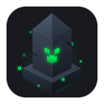

<div align="center">
  

  # Obelisk

  A GTK4 and Libadwaita Minecraft launcher for the Linux desktop.

  <p>
    <a href="https://www.rust-lang.org/"></a>
    <a href="https://gtk.org/"></a>
    <a href="https://gnome.pages.gitlab.gnome.org/libadwaita/"></a>
    <a href="https://flatpak.org/"></a>
  </p>

  <p>
    <a href="INSTALL.md">Install</a> &bull;
    <a href="docs/SCREENSHOTS.md">Screenshots</a> &bull;
    <a href="https://github.com/irelandqlan/obelisk/issues">Issues</a>
  </p>

  <a href="docs/SCREENSHOTS.md">
    
  </a>
</div>

<br>

> [!CAUTION]
> Made while assisted by AI for repetitive tasks, I know this is often a dealbreaker

> [!WARNING]
> Still in active development. Bugs and potential data loss can happen, so back up your instances and worlds.

---

## About

Obelisk is a Minecraft launcher designed specifically for the GNOME desktop environment.

It uses the same instance layout (`mmc-pack.json`) as Prism Launcher and MultiMC. If you already have instances from those launchers, you can generally reuse them directly.

## Features

- **Instance Management**: Create, edit, and launch Minecraft versions with their own mod sets, worlds, and custom settings.
- **Mod Loaders**: Handles setup for Fabric, Forge, NeoForge, and Quilt.
- **Modrinth Integration**: Search, download, and update mods, modpacks, resource packs, and shaders directly in the app.
- **Accounts**: Supports both Microsoft OAuth and offline profiles.
- **Java Manager**: Download and manage isolated runtimes (Java 8, 17, 21, and 25) or point instances to system runtimes.
- **Playtime Tracking**: Tracks session history and total hours per instance. Persists even if you remove an instance.
- **Drag and Drop**: Drop `.jar` and `.zip` files straight into the editor to install them.
- **Instance Sharing**: Export and import instances via compressed archives or share codes.
- **Adaptive UI**: Collapses into a bottom drawer layout on smaller viewports and handheld devices.

## Known Limitations and TODOs

- **No CurseForge**: Modrinth is currently the only supported mod repository. CurseForge support is not implemented yet.
- **Client ID Requirement**: Microsoft login currently requires providing your own Azure Client ID during initial setup.
- **Flatpak File Permissions**: If your instances live on a secondary drive, you may need to grant Flatpak extra filesystem permissions via Flatseal.

## Architecture

- **Language**: [Rust](https://www.rust-lang.org/)
- **UI**: [GTK4](https://gtk.org/) + [Libadwaita](https://gnome.pages.gitlab.gnome.org/libadwaita/)
- **State & Widgets**: [Relm4](https://relm4.org/)
- **Networking & Async**: [Tokio](https://tokio.rs/) and [Reqwest](https://docs.rs/reqwest)

## Installation

### Flatpak

Obelisk is built against the GNOME 50 runtime.

```bash
# Install runtimes
flatpak install flathub org.gnome.Platform//50 org.gnome.Sdk//50 org.freedesktop.Sdk.Extension.rust-stable//25.08

# Build and install locally
flatpak-builder --user --install --force-clean build-dir flatpak/io.github.irelandqlan.Obelisk.yaml

# Run
flatpak run io.github.irelandqlan.Obelisk
```

### Native

You will need development headers for GTK4, Libadwaita, OpenSSL, plus `tar` and `unzip`.

```bash
# On Debian / Ubuntu
sudo apt install build-essential pkg-config libssl-dev libgtk-4-dev libadwaita-1-dev unzip tar

# Build and run
cargo run --release
```

Detailed dependency lists for Fedora, Arch, and offline bundle creation are in [INSTALL.md](INSTALL.md).
